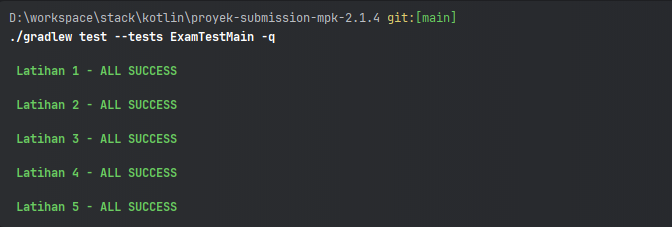

# Proyek Submission MPK 

**Aturan mengerjakan submission** 
Agar tugas submission dapat diperiksa dan diterima dengan baik, sebaiknya hindari beberapa hal berikut:

- Mengubah kode yang berada di dalam fungsi main()
- Mengubah (kecuali untuk mengerjakan TODO) atau menghapus kode yang sudah ada
- Membuat fungsi baru yang bukan merupakan tugas latihan
- Mengubah struktur project (menghapus, mengubah, atau memindahkan package)

**Test Report** 

- Test report yang dihasilkan oleh autograder dapat diakses melalui link berikut: [Test Report](./result.png)
